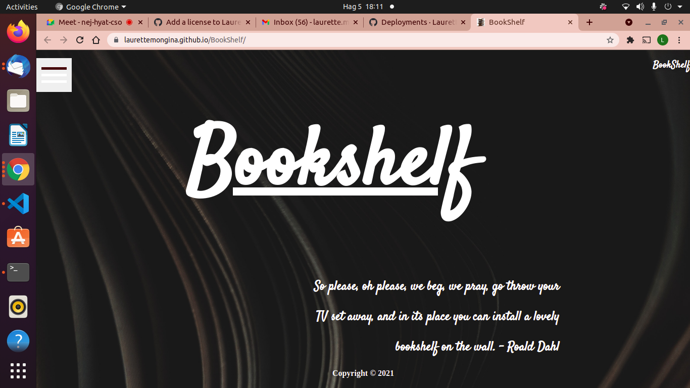
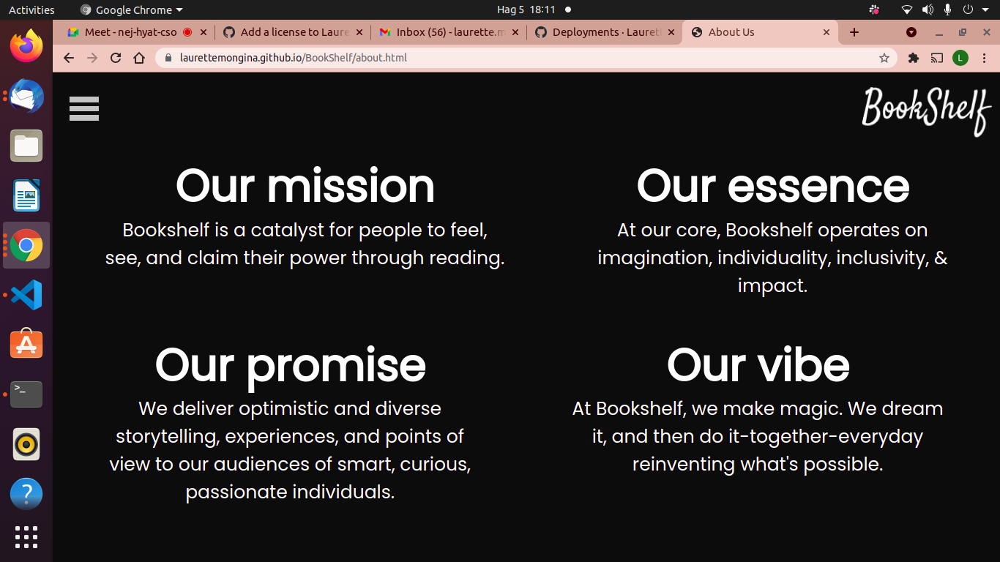
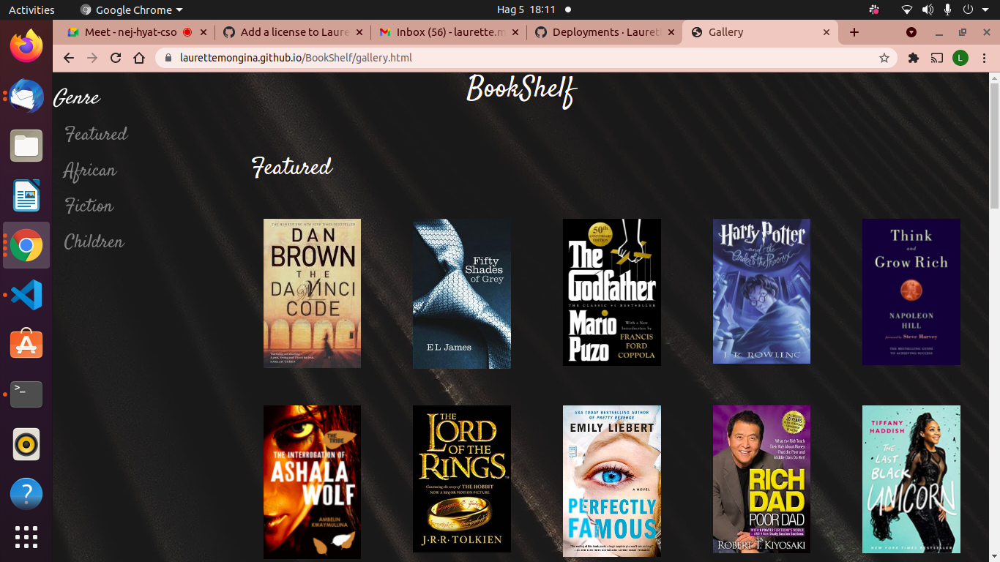
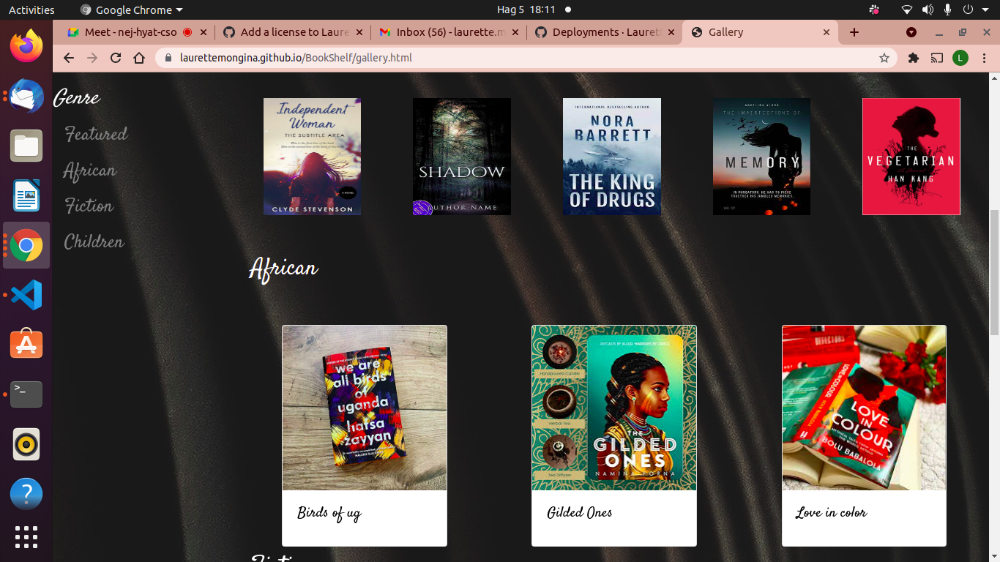
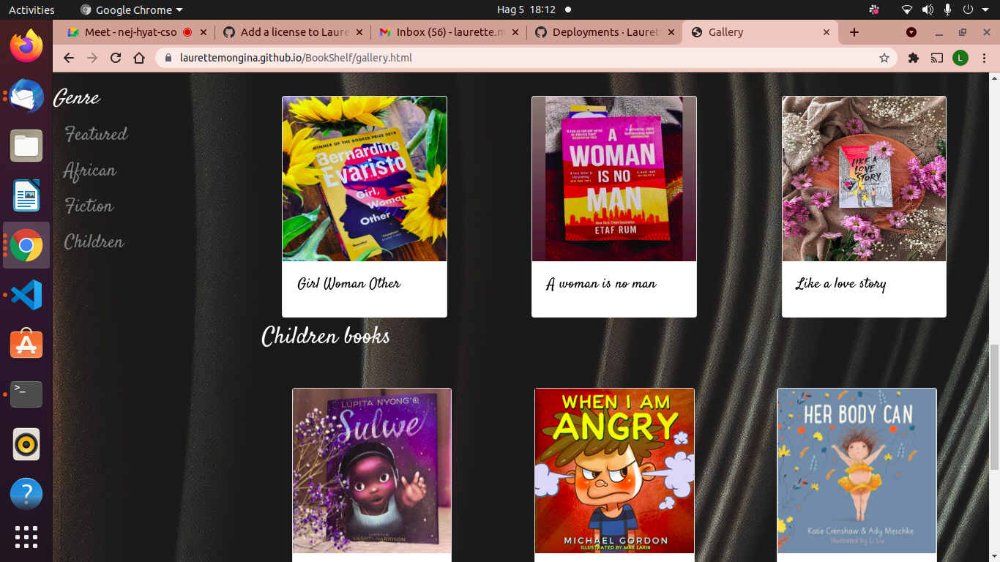
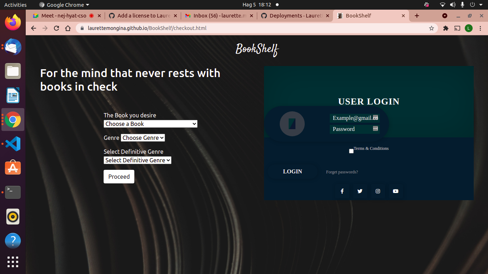
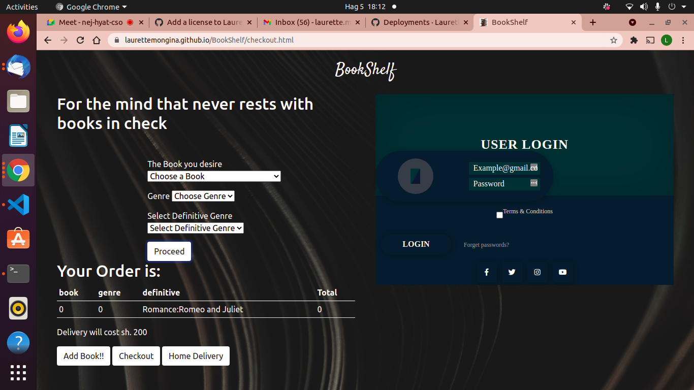

# Hello:wave:,Welcome to **BookShelf**
---
***
## Authors
1.  *[Laurette Mong'ina]*
2. *[Victoria Nawire]*
3. *[Anthony Mutuku]*
4. *[Maureen Njihia]*
# **BookShelf**
##  Project Description
### Bookshelf is a website where you can browse through various books, see our featured books of the month and if interested in a book, you can order it or borrow it for a period of time.
### >Also, user can create an account to be a member of the bookshelf team.

## Setup Instructions and Installation
- Clone the repository to a directory in you computer. Link to repo https://laurettemongina.github.io/BookShelf/
- Git init, git clone https://laurettemongina.github.io/BookShelf/
- Open terminal command line then navigate to the directory and open your using your favorite text editor.
- Open `index.html` on your Browser.
---
***
### Installation Medium
1. Steady Network.
2. Weblink
3. Github account.
---
***
## Technologies Used
* *[HTML5](https://github.com/topics/html5)*
* *[CSS](https://github.com/topics/css3)*
* *[Bootstrap](https://github.com/topics/bootstrap)*
* *[jQuery](https://github.com/topics/javascript)*
* *[javaScript](https://github.com/topics/javascript)*
---
***
# BDD
| Behaviour      | Input        | Output       |
| :------------- | :----------: | -----------: |
|  Select book |   select from options |   |
| select book genre |select from options  |  |
|select definitive | select from options |     |
| Checkout the order| :----------: | We have received your order and is being processed |
| Enter delivery details| Name, Phone number ,location  | -----------: |
---
***
## Known Bugs
The project requires backend code.
## Contact Information
1. [Email](maureen.njihia@students.moringaschool.com)
   #### [github](https://github.com/Njihia413)
2. [Email](anthony.mutuku@students.moringaschool.com)
   #### [github](anthony64m.github.io)
3. [Email](victoria.njihia@students.moringaschool.com)
   #### [github](https://github.com/victorianawire)
4. [Email](laurette.morara@students.moringaschool.com)
   #### [github](https://github.com/LauretteMongina)
---
***
#### Live Page
https://laurettemongina.github.io/BookShelf/
---
***
### LICENSE
### copyright@2021©

